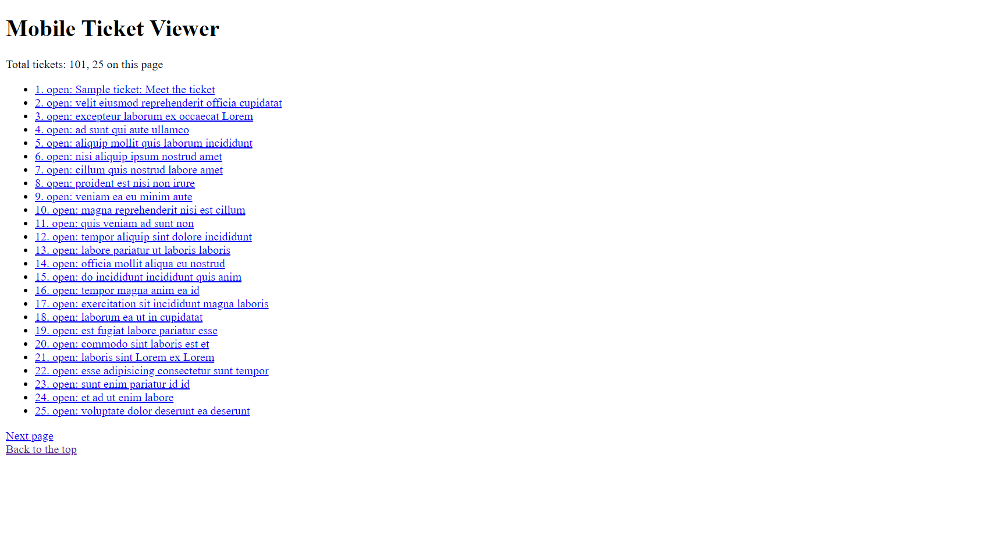

## Zendesk Coding Challenge 2022
This app is a challenge for Zendesk internship application. The main functionality is to display tickets and their details. The framework used is Node.js and Express. API calls are done using Axios. Testing is done using Jest. 

### Running the App
Install all dependencies using `npm`.
```bash
npm install
```

Steps to create authentication for api
1. Create a new folder in the project directory `auth`.
2. Create a new json file named `auth.json` in the auth folder in the following format. (subdomain refers to the string before your `.zendesk.com` domain )
```JSON
{
    "username":"[EMAIL]",
    "password":"[PASSWORD]",
    "subdomain":"[ZENDESK_SUBDOMAIN]"
}
```

Start the Node.js local server using `npm start`.
```bash
npm start
```

### Testing the App
Test the application using `npm test`.
```bash
npm test
```
Coverage report will show in the `coverage` folder.

If the authentication is set up correctly you would see the UI as below.



